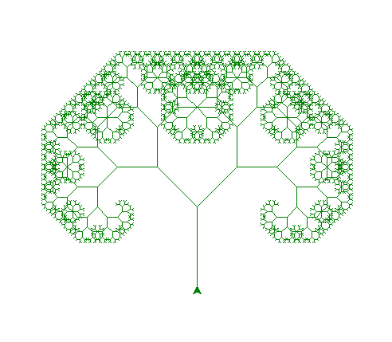
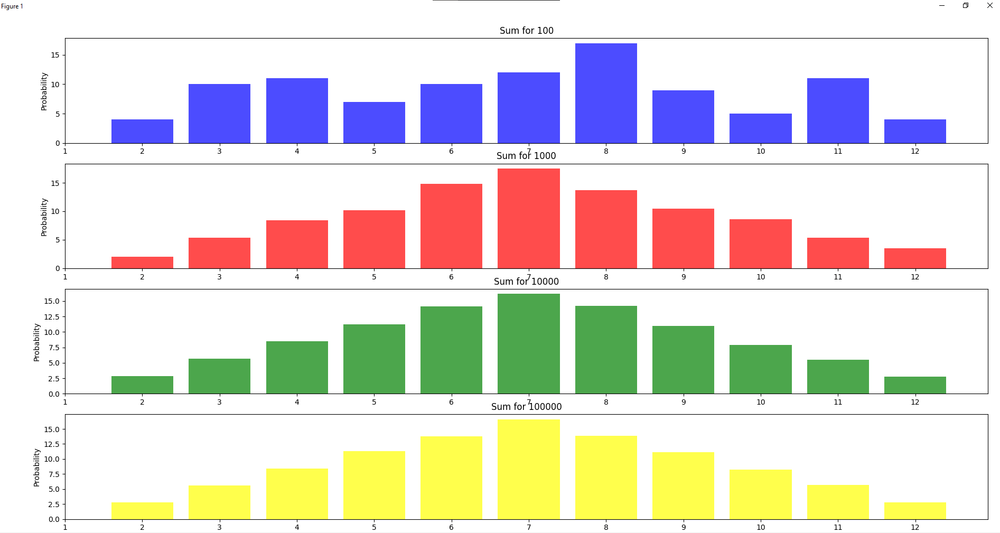

# goit-algo-fp

## Задання 1

- реалізовано реверсування лінкед списку шляхом зміни існуючого посилання попереднім
- реалізовані методи сортування 
- реалізовано злиття списків , список 2 зливається в перший список, викликаючи метод класу першим списком

## Задання 2

- побудовано дерево Пфігора з початковими значення лінії 100 та кутом нахилу 45 градусів
- користувач може ввести необхідний рівень рекурсії

## Задання 3

- реалізовано пошук найкоротшого шляху за домогою використання бінарної купи
- для реалізації алгортиму Дейкстри, також використали модуль heapq

## Задання 4-5

- побудовано бінарна купа за допомогою модуля heapq
- для перестановки елементів дерева використовувалась черга
- алгортм пошуку в глибину та ширну відтворють зміну кольорів, для кожної ітерації будується графік

## Задання 6

- жадібний алгоритм працює на основі підрахунку відношення калорійності продукту до його вартості
- шляхом сортування найбільшого співвідношення жадібний алгортм починає "купляти" відповідні продукти
- алгортим на основі динамічнго програмування працює шляхом мемомізації результатів та пошуку найбільш калорійного продукту на кожну суму, до вказаної

## Задання 7

- реалізовано визнчення ймовірності шляхом генарації рандомних чисел
- підрахована імоврність кожної із можливої суми за методом Монте-Карло
- результати представлені у вигляді графіку
- число з найбільшою ймовірністю - 7